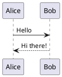
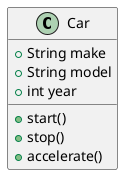
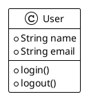
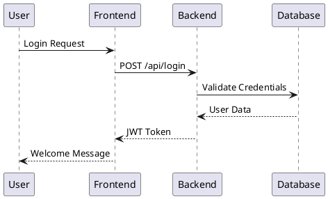
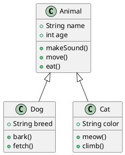
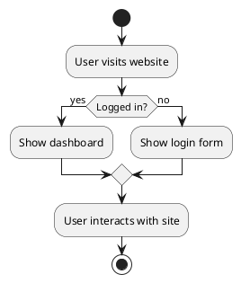

# astro-plantuml

An Astro integration for rendering PlantUML diagrams in your markdown files. This integration automatically converts PlantUML code blocks into beautiful diagrams using the PlantUML server.

## Demo Sites

- 🌐 **[Starlight Demo](https://astro-starlight-plantuml-demo.netlify.app/)** ([GitHub](https://github.com/joesaby/astro-starlight-plantuml-demo)) - Full documentation site using Starlight theme
- 🌐 **[Plain Astro Demo](https://astro-plantuml-demo.netlify.app/)** ([GitHub](https://github.com/joesaby/astro-plantuml-demo)) - Simple Astro site with PlantUML examples

## Features

- 🎨 Automatic conversion of PlantUML code blocks to images
- ⚡ Fast rendering using PlantUML's server
- 🎯 Customizable server URL and timeout settings
- 🎭 Optional CSS classes for styling
- 🔧 Configurable language identifier for code blocks
- 🌐 Support for custom PlantUML servers
- 📁 Local diagram generation and caching
- 🛠️ Built-in CLI tool for pre-generating diagrams
- 🖼️ Support for both SVG and PNG formats

## Installation

```bash
npx astro add astro-plantuml
```

## Quick Start

Check out our demo sites to see various PlantUML diagrams in action!

## Usage

1. Add the integration to your `astro.config.mjs`:

```js
import { defineConfig } from 'astro/config';
import plantuml from 'astro-plantuml';

export default defineConfig({
  integrations: [plantuml()],
});
```

2. Use PlantUML in your markdown files:

```markdown
# My Documentation

Here's a sequence diagram:



And here's a class diagram:



You can also use different themes:



## Diagram Generation Workflows

The integration supports two main workflows:

### 1. Server-Only Mode (Default)
Diagrams are generated on-demand from the PlantUML server during build time:

```js
plantuml({
  serverUrl: 'https://www.plantuml.com/plantuml/svg/',
  format: 'svg'
})
```

### 2. Local File Mode with Fallback
Pre-generate diagrams during development, then use cached files during production builds:

```js
plantuml({
  serverUrl: 'http://localhost:8080/svg/', // Local server for development
  format: 'svg',
  diagramsPath: 'diagrams' // Enable local file lookup
})
```

## Pre-generating Diagrams

Use the built-in CLI tool to generate diagrams ahead of time:

### Command Line Usage

```bash
# Generate diagrams for all markdown files
npx astro-plantuml generate

# Generate for specific files/patterns
npx astro-plantuml generate "src/pages/**/*.md"
npx astro-plantuml generate "docs/*.md"
```

### Integration with Build Tools

**Package.json Scripts:**
```json
{
  "scripts": {
    "generate-diagrams": "astro-plantuml generate",
    "prebuild": "astro-plantuml generate"
  }
}
```

**Git Hooks (`.git/hooks/pre-commit`):**
```bash
#!/bin/sh
echo "Generating PlantUML diagrams..."
npx astro-plantuml generate
git add diagrams/
```

**GitHub Actions:**
```yaml
- name: Generate PlantUML diagrams
  run: npx astro-plantuml generate
```

## Configuration

You can configure the integration with the following options:

**With a PlantUML server:**

```js
plantuml({
  // URL of the PlantUML server (default: 'http://www.plantuml.com/plantuml/png/')
  serverUrl: 'https://your-custom-plantuml-server.com/plantuml/png/',
   
  // Timeout for HTTP requests in milliseconds (default: 10000)
  timeout: 10000,
  
  // Whether to add CSS classes to wrapper elements (default: true)
  addWrapperClasses: true,
  
  // Language identifier in code blocks (default: 'plantuml')
  language: 'plantuml'
})
```

**Using pre-generated diagrams for prod builds:**

```js
plantuml({
  // URL of the PlantUML server (default: 'http://www.plantuml.com/plantuml/svg/')
  serverUrl: 'https://your-custom-plantuml-server.com/plantuml/svg/',
  
  // Expected image format, either PNG or SVG
  format: 'svg', 
   
  // Path for storing/reading pre-generated diagrams (default: undefined)
  // When set, enables local file lookup with server fallback
  diagramsPath: process.env.NODE_ENV === 'production' ? 'diagrams' : undefined,
  
  // Timeout for HTTP requests in milliseconds (default: 10000)
  timeout: 10000,
  
  // Whether to add CSS classes to wrapper elements (default: true)
  addWrapperClasses: true,
  
  // Language identifier in code blocks (default: 'plantuml')
  language: 'plantuml',
  
  // Remove inline styles from SVG for better CSS control (default: false)
  // Only applies when format is 'svg'
  removeInlineStyles: true
})
```

### Using a Custom PlantUML Server

By default, the integration uses the public PlantUML server. However, you can use your own PlantUML server by setting the `serverUrl` option. This is useful when you:

- Need better performance or reliability
- Want to avoid rate limits
- Need to use custom themes or styles
- Want to keep your diagrams private

Example using a custom server:

```js
plantuml({
  serverUrl: 'https://your-custom-plantuml-server.com/plantuml/png/',
  // ... other options
})
```

You can set up your own PlantUML server using:
- Docker: `docker run -d -p 8080:8080 plantuml/plantuml-server:jetty`
- Java: Run the PlantUML server JAR file
- Other deployment options as per PlantUML's documentation

### CSS Styling

When `addWrapperClasses` is enabled (default), the integration adds the following CSS classes:

- `plantuml-diagram`: Wrapper around the diagram
- `plantuml-img`: The actual image element (PNG format)
- `plantuml-svg`: The SVG element (SVG format)
- `plantuml-error`: Error message container

You can style these in your CSS:

```css
.plantuml-diagram {
  margin: 2rem 0;
  text-align: center;
}

.plantuml-img {
  max-width: 100%;
  height: auto;
  border: 1px solid #eee;
  border-radius: 4px;
}

.plantuml-svg {
  max-width: 100%;
  height: auto;
  border: 1px solid #eee;
  border-radius: 4px;
}

.plantuml-error {
  background: #fee;
  border: 1px solid #f99;
  padding: 1rem;
  border-radius: 4px;
  margin: 1rem 0;
}
```

## Examples

### Sequence Diagram


### Class Diagram


### Activity Diagram


## Error Handling

If there's an error generating a diagram, the integration will:
1. Display an error message
2. Keep the original code block for reference
3. Add the `plantuml-error` class to the error container

## Changelog

### [0.1.2] - 2024-01-26
#### Fixed
- 🐛 Fixed PlantUML rendering by switching from rehype to remark plugin
- 🚀 Plugin now processes code blocks before syntax highlighting
- 🔧 Fixed encoding issue with PlantUML server (using deflateRawSync instead of deflateSync)
- 🧹 Removed deprecated rehype plugin

#### Changed
- Remark plugin runs before Shiki to prevent language warnings

### [0.1.1] - 2024-01-25
#### Added
- 🎉 Initial release
- ✨ Basic PlantUML rendering functionality
- 🎨 Configurable options (serverUrl, timeout, addWrapperClasses, language)
- 📚 Support for all PlantUML diagram types
- 🔧 Error handling with fallback to original code block

### [0.1.0] - 2024-01-24
#### Added
- 🚀 Initial development version
- ⚡ Core integration with Astro
- 🎯 Basic PlantUML to image conversion

## Publishing

### Prerequisites
1. Ensure you have npm publish permissions for the `astro-plantuml` package
2. Make sure you're logged in to npm: `npm login`
3. All tests should pass and the package should build successfully

### Publishing Steps

1. **Update Version**
   ```bash
   # For patch release (bug fixes): 0.1.2 -> 0.1.3
   npm version patch
   
   # For minor release (new features): 0.1.2 -> 0.2.0
   npm version minor
   
   # For major release (breaking changes): 0.1.2 -> 1.0.0
   npm version major
   ```

2. **Build the Package**
   ```bash
   npm run build
   ```

3. **Test Locally** (optional but recommended)
   ```bash
   # Create a tarball
   npm pack
   
   # Test in another project
   npm install /path/to/astro-plantuml-0.1.3.tgz
   ```

4. **Update Changelog**
   - Add new version entry to the Changelog section above
   - Document all changes, fixes, and new features
   - Use semantic versioning and date format

5. **Commit Changes**
   ```bash
   git add .
   git commit -m "Release v0.1.3"
   git push origin main
   ```

6. **Create Git Tag**
   ```bash
   git tag v0.1.3
   git push origin v0.1.3
   ```

7. **Publish to npm**
   ```bash
   npm publish
   ```

8. **Verify Publication**
   - Check npm page: https://www.npmjs.com/package/astro-plantuml
   - Test installation: `npm install astro-plantuml@latest`

### Post-Publishing
1. Update demo sites with the new version
2. Create a GitHub release with release notes
3. Announce in relevant channels (Discord, Twitter, etc.)

## Demo

Visit our demo sites to see:
- Sequence diagrams
- Class diagrams
- Activity diagrams
- State diagrams
- Component diagrams
- Mind maps
- Gantt charts

## License

MIT 
