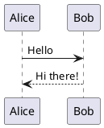
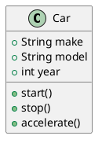
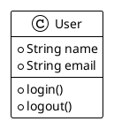
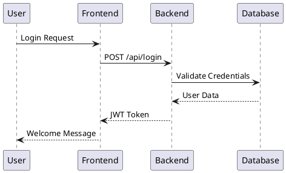
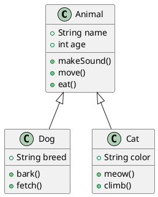
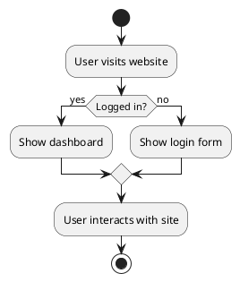

# astro-plantuml

An Astro integration for rendering PlantUML diagrams in your markdown files. This integration automatically converts PlantUML code blocks into beautiful diagrams using the PlantUML server.

## Features

- 🎨 Automatic conversion of PlantUML code blocks to images
- ⚡ Fast rendering using PlantUML's server
- 🎯 Customizable server URL and timeout settings
- 🎭 Optional CSS classes for styling
- 🔧 Configurable language identifier for code blocks
- 🌐 Support for custom PlantUML servers

## Installation

```bash
npm install astro-plantuml
```

## Usage

1. Add the integration to your `astro.config.mjs`:

```js
import { defineConfig } from 'astro/config';
import plantuml from 'astro-plantuml';

export default defineConfig({
  integrations: [plantuml()],
});
```

2. Use PlantUML in your markdown files:

```markdown
# My Documentation

Here's a sequence diagram:



And here's a class diagram:



You can also use different themes:


```

## Configuration

You can configure the integration with the following options:

```js
plantuml({
  // URL of the PlantUML server (default: 'http://www.plantuml.com/plantuml/png/')
  serverUrl: 'https://your-custom-plantuml-server.com/plantuml/png/',
  
  // Timeout for HTTP requests in milliseconds
  timeout: 10000,
  
  // Whether to add CSS classes to wrapper elements
  addWrapperClasses: true,
  
  // Language identifier in code blocks
  language: 'plantuml'
})
```

### Using a Custom PlantUML Server

By default, the integration uses the public PlantUML server. However, you can use your own PlantUML server by setting the `serverUrl` option. This is useful when you:

- Need better performance or reliability
- Want to avoid rate limits
- Need to use custom themes or styles
- Want to keep your diagrams private

Example using a custom server:

```js
plantuml({
  serverUrl: 'https://your-custom-plantuml-server.com/plantuml/png/',
  // ... other options
})
```

You can set up your own PlantUML server using:
- Docker: `docker run -d -p 8080:8080 plantuml/plantuml-server:jetty`
- Java: Run the PlantUML server JAR file
- Other deployment options as per PlantUML's documentation

### CSS Styling

When `addWrapperClasses` is enabled (default), the integration adds the following CSS classes:

- `plantuml-diagram`: Wrapper around the diagram
- `plantuml-img`: The actual image element

You can style these in your CSS:

```css
.plantuml-diagram {
  margin: 2rem 0;
  text-align: center;
}

.plantuml-img {
  max-width: 100%;
  height: auto;
  border: 1px solid #eee;
  border-radius: 4px;
}
```

## Examples

### Sequence Diagram


### Class Diagram


### Activity Diagram


## Error Handling

If there's an error generating a diagram, the integration will:
1. Display an error message
2. Keep the original code block for reference
3. Add the `plantuml-error` class to the error container

## License

MIT 