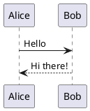

# Installation

## Prerequisites

Before installing astro-plantuml, make sure you have:

- An Astro project (version 4.0.0 or higher)
- Node.js 18.14.1 or higher

## Installing astro-plantuml

1. Install the package using npm:

```bash
npm install astro-plantuml
```

2. Add the integration to your `astro.config.mjs`:

```js
import { defineConfig } from 'astro/config';
import plantuml from 'astro-plantuml';

export default defineConfig({
  integrations: [plantuml()],
});
```

## Verifying Installation

To verify that the integration is working correctly, you can create a test markdown file with a simple PlantUML diagram:

```markdown
# Test PlantUML



If you see the diagram rendered correctly, then the installation was successful! 