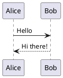

# astro-plantuml

astro-plantuml is an Astro integration that allows you to create and render PlantUML diagrams directly in your markdown files. With this integration, you can:

- Write PlantUML diagrams using simple text notation
- Render diagrams as SVG images
- Customize the PlantUML server and theme
- Use diagrams in your documentation, blog posts, or any markdown content

## What is PlantUML?

PlantUML is a tool that allows you to create UML diagrams using simple text notation. It supports various types of diagrams including:

- Sequence diagrams
- Class diagrams
- Use case diagrams
- Activity diagrams
- Component diagrams
- And many more!

Here's a simple example of what you can do with astro-plantuml:

## Why astro-plantuml?

- **Easy to use**: Just write PlantUML syntax in your markdown files
- **Fast rendering**: Diagrams are rendered on-the-fly
- **Customizable**: Use your own PlantUML server or customize the theme
- **Perfect for documentation**: Great for technical documentation, API docs, and more 