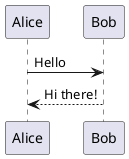

# astro-plantuml

astro-plantuml is an Astro integration that allows you to create and render PlantUML diagrams directly in your markdown files. With this integration, you can:

- Write PlantUML diagrams using simple text notation
- Render diagrams as SVG or PNG images
- Pre-generate diagrams for faster builds and offline use
- Customize the PlantUML server and styling options
- Use built-in CLI tools for diagram generation
- Use diagrams in your documentation, blog posts, or any markdown content

## What is PlantUML?

PlantUML is a tool that allows you to create UML diagrams using simple text notation. It supports various types of diagrams including:

- Sequence diagrams
- Class diagrams
- Use case diagrams
- Activity diagrams
- Component diagrams
- And many more!

Here's a simple example of what you can do with astro-plantuml:

## Why astro-plantuml?

- **Easy to use**: Just write PlantUML syntax in your markdown files
- **Fast rendering**: Diagrams are rendered on-the-fly or pre-generated
- **Multiple formats**: Support for both SVG and PNG output
- **Build optimization**: Pre-generate diagrams for faster, offline-capable builds
- **Highly customizable**: Use your own PlantUML server, customize styling, and more
- **Developer friendly**: Built-in CLI tools and workflow integration
- **Perfect for documentation**: Great for technical documentation, API docs, and more

## Key Features

### 🎨 Multiple Output Formats
Choose between SVG (scalable, CSS-styleable) or PNG (simple, widely compatible) formats.

### 📁 Local File Caching
Pre-generate diagrams during development and use cached files during production builds for improved performance.

### 🛠️ Built-in CLI Tools
Use `npx astro-plantuml generate` to pre-generate diagrams as part of your build workflow.

### ⚡ Flexible Workflows
Support for both server-only and local-file-with-fallback workflows to fit your development process.

### 🎯 Smart Caching
Only regenerates diagrams when content changes, using content-based hashing for efficiency. 