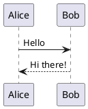
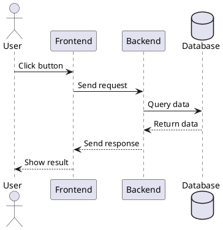
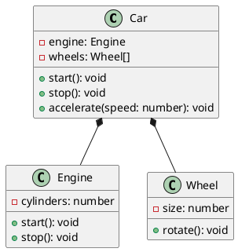
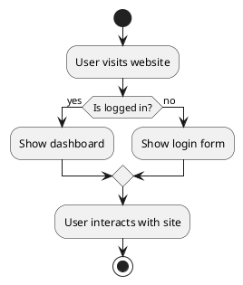

# Usage

## Basic Usage

To create a PlantUML diagram in your markdown files, simply use the `plantuml` code fence:

```markdown


The integration supports two output formats:
- **PNG** (default): Raster images, good for simple diagrams
- **SVG**: Vector graphics, scalable and CSS-styleable

Configure the format in your `astro.config.mjs`:

```js
plantuml({
  format: 'svg' // or 'png'
})
```

## Examples

### Sequence Diagram



### Class Diagram



### Activity Diagram



## Advanced Usage

### Pre-generating Diagrams

For faster builds and offline capability, you can pre-generate diagrams:

```bash
# Generate diagrams for all markdown files
npx astro-plantuml generate

# Generate for specific patterns
npx astro-plantuml generate "src/pages/**/*.md"
```

Enable local file lookup in your configuration:

```js
plantuml({
  format: 'svg',
  diagramsPath: 'diagrams' // Look for pre-generated files here
})
```

### SVG Styling

When using SVG format, you can style diagrams with CSS:

```js
plantuml({
  format: 'svg',
  removeInlineStyles: true, // Remove default styles
  addWrapperClasses: true   // Add CSS classes
})
```

Then style with CSS:

```css
.plantuml-svg {
  max-width: 100%;
  border: 1px solid #ddd;
  border-radius: 8px;
}
```

## Tips and Best Practices

1. **Use meaningful names**: Give your diagrams and elements clear, descriptive names
2. **Choose the right format**: Use SVG for scalable, styleable diagrams; PNG for simple use cases
3. **Pre-generate for production**: Use `npx astro-plantuml generate` for faster, more reliable builds
4. **Use local servers**: Run a local PlantUML server during development for speed
5. **Keep it simple**: Start with basic diagrams and add complexity as needed
6. **Use comments**: Add comments to explain complex parts of your diagrams
7. **Test your diagrams**: Always verify that your diagrams render correctly

## Common Issues

If your diagrams don't render:

1. Make sure you're using the correct code fence syntax (`plantuml`)
2. Check that the PlantUML syntax is valid
3. Verify that the integration is properly configured in your `astro.config.mjs`
4. Ensure you have an internet connection (for the default PlantUML server) 