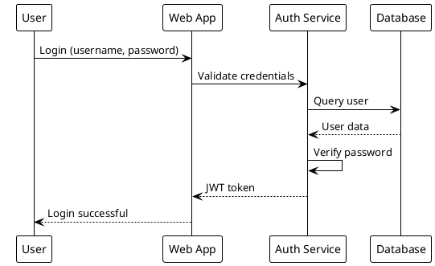
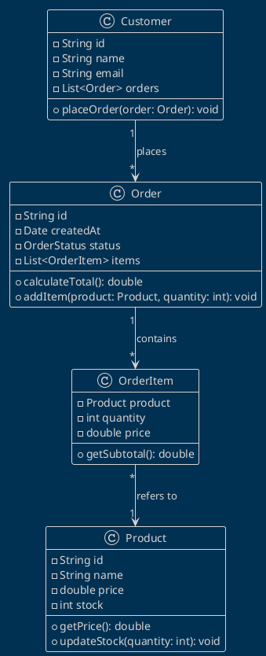
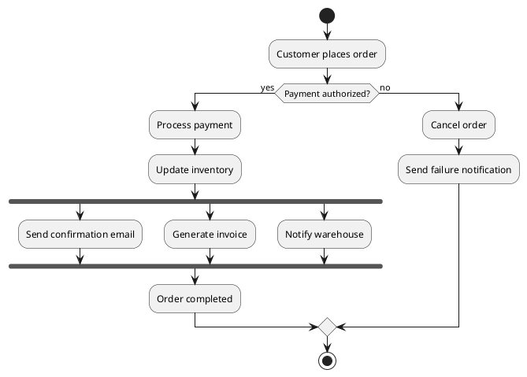
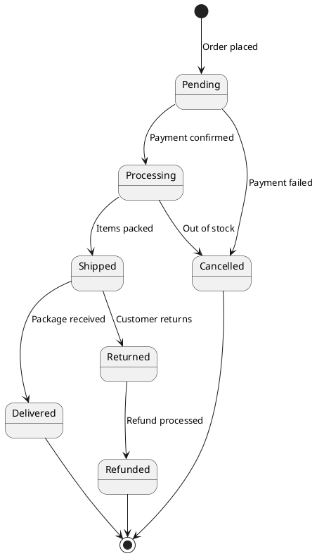
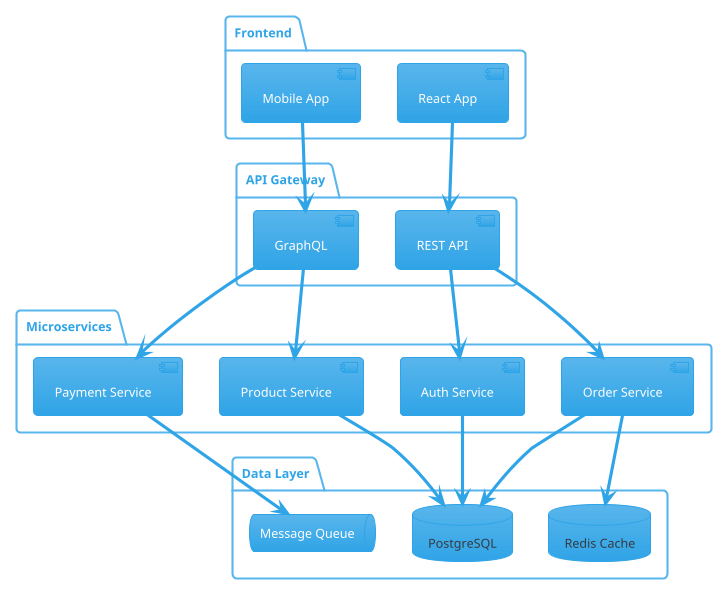
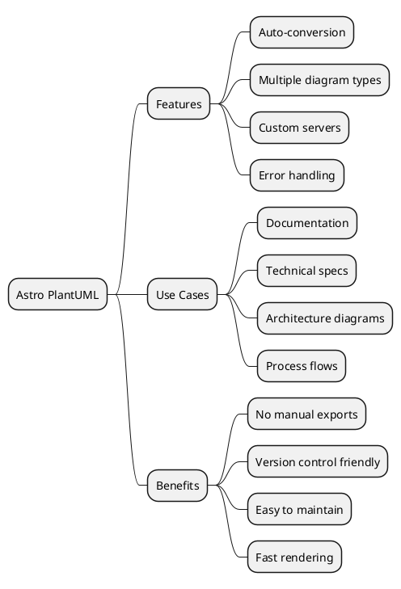
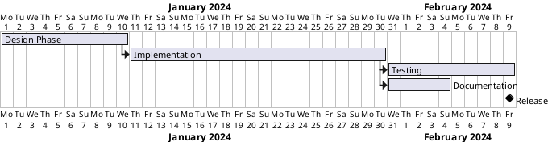

# Astro PlantUML Integration Demo

Welcome to the demo of the `astro-plantuml` integration! This page showcases various PlantUML diagrams rendered directly from markdown code blocks.

## Sequence Diagram

Here's a simple sequence diagram showing a user authentication flow:

## Class Diagram

A typical e-commerce system class structure:

## Activity Diagram

The order processing workflow:

## State Diagram

Order lifecycle states:

## Component Diagram

System architecture overview:

## Mind Map

Project features overview:

## Gantt Chart

Development timeline:

---

*This demo is powered by [astro-plantuml](https://github.com/yourusername/astro-plantuml)*